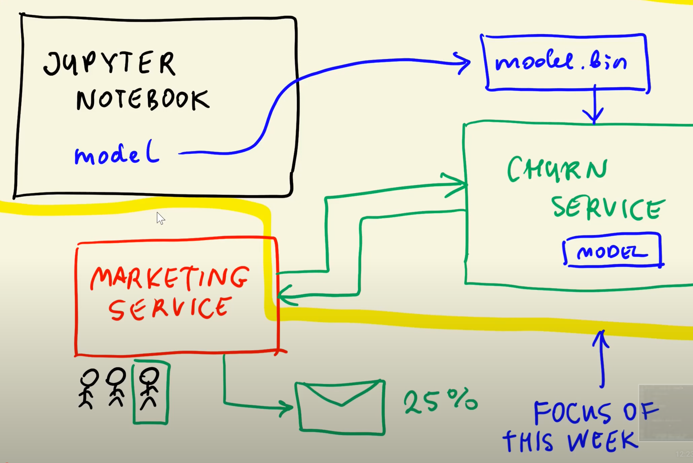

# Model Deployment

We have used jupyter notebook until now to build models but it's not meant for production environments because it may contain plots and other things that are useful for analysis or understanding of models but are not necessary in production. So for production we will extract our model into a pickle file and we will use webservices to generate predicitons.

We will be using the same churn prediction model that we created previuosly and we will deploy it using flask.

The below chart describes how we will converting our model which we created in jupyter notebook into a web service and how it will be used by the marketing serive to send mails to customers who are churning.



- we will be creating a ```model.bin``` file in which we will store our model. 
- Then we will create a ```Churn webserive``` through which we will access our model and allow other components to access it and make predictions.
- The model then will be utilised by ```Marketing service```, the users input customer data into the service and the service communicates with Churn to request a prediction. Once the prediction is received, the service can execute whichever task is deemed appropiate, suchn as sending emails with offers to potentially churning customers.  

### Extracting the model

