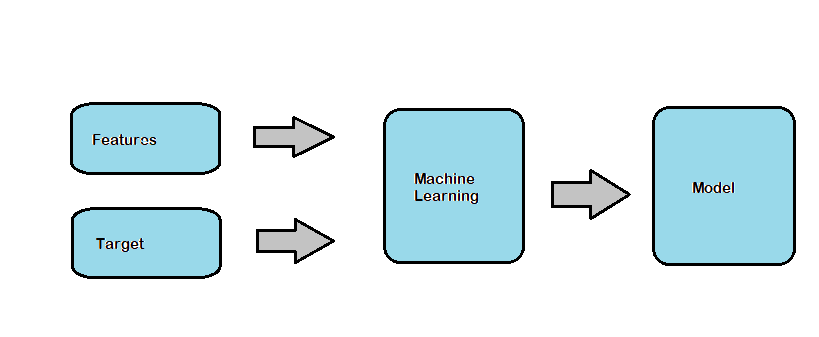

## Introduction

*Machine Learning* is the use and development of computer systems that are able to learn and adapt without following explicit instructions, by using algorithms and statistical models to analyse and draw inferences from patterns in data.

Let's learn with the help of an exmaple.

Imagine we have a car classified website where you go if you want to sell or buy a car. Now if someone wants to sell the car they put the features of the car, pictures and list their price. Now the seller want's to find a price which is relevant to the car and not go too high or too low with the prices. Now as a owner of the webiste we will use machine learning to provide the correct price for the car to be sold based on the features.
We will ask seller to provide features like listed below

| Year | Manufacturer | Mileage | ... | Price |
|------|---------|---------|-----|-------|
| 1995 | BMW     | 8 mpl   | ... | $18k  |
| 1980 | Audi    | 5 mpl   | ... | $22k  |
| 2012 | Ford    | 12mpl   | ... | $12k  |

and we will use these kind of features to predict our price.

- **Features** - The characteristics of the data (characteristics of car in this case).
- **Target** - The characteristic we are trying to predict (price of the car in this case).
- **Model** - It is the description of statistical patterns that predicts a target based on the input provided. It encapsulates all the patterns it can get from the features and the traget provided.

</img>

- **Prediction** - The result we get after providing the features to the model we developed (price suggestion of the car listed by the seller).

## Machine Learning vs Rule based system

- **Rule based system** is traditional system where certain rules are defined for the approach and model is developed based on the set of rules. The evaluation will be done based on those rules. The major drawback is we have to keep updating our rules frequently to deal with changes in complexity and behaviour of our problem.

**Example**

Developing a spam email detection system. 

In rule based system, we will define a set of rules like:
 - If the sender email contains words like 'promotions' or 'alert', we will classify it as spam 
 - If the email subject contains words like 'congratulations' or 'jackpot' then also we will classify it as spam.

 ```
 def detect_spam(email):
    if email.sender.contains(['promotions','alert']):
        return spam
    if email.title.contains(['congratulations','jackpot]):
        return spam
    return good
```

We have set some rules to classify email as spam but what if the keywords change instead of 'promotions' they use words like 'Hurray' we again have to modify our model and these words will keep on changing which makes the model unsustainable.

Developing the spam detection system using ML:
- we have to collect data of both spam emails and not spam emails.
- we have to extract features from the dataset that will classify the email as spam or not.
- we will use these data and features to train our model and then we will generate our prediction based on that.

ML doesn't completely discard all rule based systems but it builds on top of it like for what value in features the email is categorized as spam we need to have some set of rules:
 - length of title > 10? true/false
 - length of body > 100? true/false
 - sender email contains 'promotions'? true/false
 - sender domain contains 'test.com'? true/false
 - description contains 'congratulations'> 3 times? true/false

we have defined set of rule to bulid our model and based on that we will generate our predicitons on the probability of email to be a spam.

In rule based system we feed data and code to the system to generate some outcome.
- Data + Code -------> Outcome

While in ML system we feed  data and outcome to the system to generate a model based on which we generate predictions.
- Outcome + Data -------> Model 

## Supervised Machine Learning

We have seen two examples Car price prediction and Spam detection system. In both cases there is one thing in common ie the prediction target is provided which is also referred as labels. These kind of problems belongs to *Supervised Machine Learning*. In Supervised ML the target exists. 

The other types of machine learnings which deals with data where there is no target defined are Unsupervised learning and Reinforcement learning.

Considering the spam detection system, we predicted the email is spam or not based on certain features. The features are stored in form of matrix known as X in which each row is observation and each column is a feature. The target column is denoted as y as shown below.

| features (X)|||||   target (y)||
|---|---|---|---|---|---|---|
|   | f1| f2| f3| f4|   | y |
|obs1| 1| 1 | 0 | 1 |   | 1 |
|obs2| 1| 0 | 0 | 1 |   | 0 |
|obs3| 0| 1 | 0 | 0 |   | 0 |
|obs4| 1| 1 | 1 | 1 |   | 1 |

We can define our model as a function **g** that takes our feature matrix **X** and outputs a value which is approximate to our target **y**
 - **g(X) ~ y**

### Types of Supervised ML
There are mainly two types of problems in Supervised ML:
 - Regression (Car price prediction)
 - Classification (Spam email detection)
However there is one more type known as *ranking* which categorises the values based on rank like most popular product for the user in ecommerce website.

 - **Regression problems** target is a continous value, like getting some numbers as output such as car price, house price etc
 - **Classification problems** target are categories, like getting true/false values such as email is spam or not. Classiication problems can also have multiple categoreis thence they are of two types:
    - **Binary classification** when the target consists of only two categories like email is spam or not.
    - **Multiclass classification** when target consists of multiple categories like classifying animals using images if it's a dog, cat or horse.

## CRISP-DM
It stands for *Cross Industry Standard Process for Data Mining*. It's a methodology which includes decsriptions of the typical phases of a project, the tasks involved with each phase, and an explaination of the relationships between these tasks.

</img>

1. Business understanding
    - Identify the business problem, understand how we can solve here.
    - Ask ourseleves, do we even need ML for this case. If not what approach to take.
    - Analyze to what extent it's a problem
    - define the goal and the goal has to be measurable
2. Data understanding
    - Analyze available data sources and decide if we need to get more data.
    - Is the data reliable
    - Is dataset is large enough
    - Are we tracking the data correctly
3. Data preparation
    - Transform the data so it can be put into a ML algorithm.
    - Clean the data
    - Build the pipelines - sequqence of steps that takes raw data and outputs clean data.
    - Convert data into a tabular form
4. Modelling
    - Training the models - the actual machine learning happens here.
    - try different models and select the best one
        - logistic regression
        - Decision tree
        - Neural network
        - or many others
    - Add new features
    - Fix data issues
5. Evaluation
    - Measures how well the model solves the problem
    - Have we reached the goal
    - Do our metrics improve
    - Go back and adjust the goal
    - Did we solve/meansure the right thing
    - Roll the model to more users
    - Stop working on the project
6. Deployment
    - Evaluation of live users
    - Deploy the model to production
    - Proper monitoring
    - Ensuring the quality and maintainability

Iterate - ML projects require many iterations.

## Model Selection

### Evaluation and Accuracy of model
To choose our best model among many others, we need ways to evaluate how good a given model is.

We do this by splitting the dataset into a training dataset and validation dataset. This split is usually done as 80% for training and 20% for validation. The validation dataset is kept "hidden" from the model and only training dataset is used for training the model.

We can extract feature matrix X and target y from the training dataset and train a model g. We can extract another feature matrix Xv and target yv from the validation dataset, and then obtain predictions

g(Xv) = ŷv

Finally, we compare our prediction ŷv with our target yv and check how different they are, thus obtaining an accuracy score.

By comparing accuracy scores between our models, we can decide which model is better for our problem.

### Multiple comparisons problem

we should be aware of the multiple comparisons problem (AKA the look-elsewhere effect). This problem is defined as:
- While the chance of noise affecting one result may be small, the more measurements we make, the larger the probability that a random fluctuation is missclassified as a meaningful result.

In ML, this means that when we use multiple models and compare results, one model may get "lucky" and show significant better results than other just because the data split was favorable to that model.

So, to resolve this problem, we split the entire dataset into 3 parts:
 - 60% for training
 - 20% for validation
 - 20% for test

We will develop our model based on the following steps:
- we will train the models with the training dataset.
- We will validate our model with the validation dataset and choose the model which performed the best.
- We will test the model with test dataset and verif if the accuracy is similar to as of the validation dataset then only we will consider the model will perform well in real world. If the result is different then we can say that we got a lucky model and we must look for other models.

### Summarizing the model selection process
 - Split the original dataset into train-validation-test datasets.
 - Train the model
 - Validate the model. If accuracy is not good repeat the previous step with different model.
 - Select the best model.
 - Check the accuracy is good enough.

 After we select our best model by doing all the above steps then we will retrain the model again on train+validation dataset as we don't want the validation dataset to be wasted here. Then we will again validate the model using the test dataset. This will improve the model to some extent.

## Introduction to NumPy
 
NumPy is a library for the Python programming language, adding support for large, multi-dimensional arrays and matrices, along with a large collection of high-level mathematical functions to operate on these arrays.

## Linear Algebra

### Vector operations


- Scalar product
    - Product of a real number and a 1-D vector. Results in a new 1-D vector.
    - k * v = k * [v1, v2, v3] = [k * v1, k * v2, k * v3]
    - Called "scalar product" because the resulting vector is a scaled version of the original vector.
    - In linear algebra notation, the vector is often represented as a column vector.
    - NumPy: np.multiply(k, v)
    - Python: k * v
- Vector addition
    - Addition of each component of 2 1-D vectors Results in a new 1-D vector.
    - u + v = [u1, u2, u3] + [v1, v2, v3] = [u1 + v1, u2 + v2, u3 + v3]
    - Geometrically, it's as if we took one of the vectors and made it start from the point where the other vector ends. The line between the point of origin of the first vector and the end of the second vector is the resulting vector.
    - Both vectors are alos represented as column vectors.
    - NumPy: np.add(u,v)
    - Python: u + v
- Combining scalar products and vector additions is called a linear combination of vectors.
- Dot product (vector-vector product)
    - Product of 2 1-D vectors. Results in a scalar.
    - u · v = [u1 , u2, u3] ⋅ [v1, v2, v3] = u1v1 + u2v2 + u3v3
    - Geometrically, it can be understood as the multiple of the lengths of the 2 vectors and the angle between them.
    - In linear algebra notation, the first vector is represented as a row vector and the second as a column vector.
    - Both vectors must be of the same length.
    - NumPy: the operation can be done with np.dot(u,v)
    - Python (v3.5+): u @ v

### Matrix operations
- Matrix-vector product
    - Product of a 2-D matrix and a 1-D vector. Results in a 1-D vector.
    - In algebra notation, the matrix goes first and the vector second, displayed as a column matrix.
    - Essentially it's a dot product of each row of the matrix with the vector. Each dot product result is a component of the result vector.
    - The matrix must have as many columns as the vector has components.
    - For a matrix of size (n,k) and a vector of size (k), the resulting vector will be of size (n).
    - NumPy: np.dot(U,v) can also handle matrix-vector multiplications.
    - Python (3.5+): U @ v
- Matrix-matrix product
    - Product of 2 2-D matrices. Results in a 2-D matrix.
    - The first matrix must have as many columns as the second matrix has rows.
    - For 2 matrices of sizes (n,k) and (k,m), the resulting matrix will be of size (n,m).
    - Essentially it's a matrix-vector product of the first matrix and each column of the second matrix. The resulting vectors will be the columns of the resulting matrix.
    - NumPy: np.matmul(U, V)
    - Python (3.5+): U @ V

### Identity matrix
- An identity matrix is a square matrix (matrix of size (n,n)) entirely made of 0's, except for its diagonal which is made of 1's.
```
  1 0 0 0
  0 1 0 0
  0 0 1 0
  0 0 0 1
```
- The identity matrix is the equivalent of the number 1 in scalar product. Given a matrix U and the identity matrix I:
    - U · I = I · U = U
- NumPy: np.eye(n) will return an identity matrix
    - n: size of the identity matrix.

### Matrix inverse
- Given a square matrix A, we can define its inverse matrix A⁻¹ as a matrix that multiplied by the original matrix A results in the identity matrix I
    - A · A⁻¹ = A⁻¹ · A = I
- Only square matrices may have inverse matrices. Not every square matrix has an inverse matrix. A non-invertible matrix is called singular or degenerate.
- NumPy: np.linalg.inv(A)
- Inverse matrices are important because they are necessary to solve complex operations.

## Introduction to Pandas

Pandas is a software library written for the Python programming language for data manipulation and analysis. In particular, it offers data structures and operations for manipulating numerical tables and time series. 

### Features of Pandas:
- DataFrame object for data manipulation with integrated indexing.
- Tools for reading and writing data between in-memory data structures and different file formats.
- Data alignment and integrated handling of missing data
- Reshaping and pivoting of data sets
- Label-based slicing, fancy indexing, and subsetting of large data sets.
- Data structure column insertion and deletion
- Group by engine allowing split-apply-combine operations on data sets.
- Data set merging and joining
- Time series-functionality
